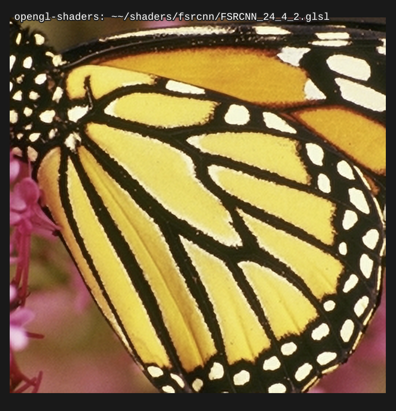
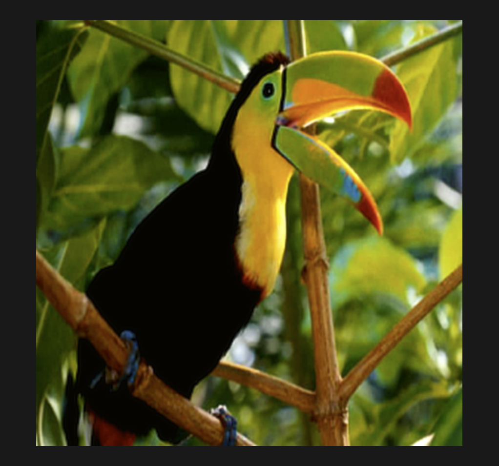
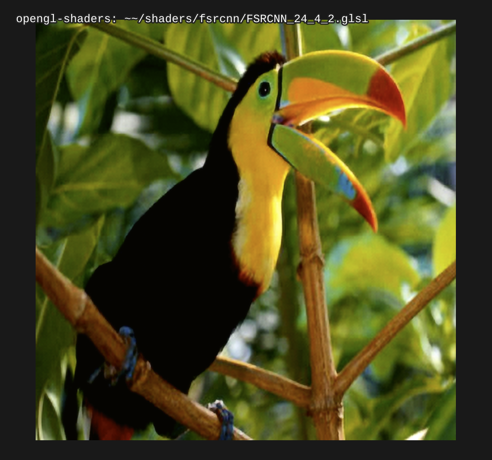

# IMPORTANT

Using these in mpv currently requires ``--opengl-fbo-format=rgba32f``, because
the neural network's intermediate results contain arbitrary floats!!

I plan on perhaps trying to train a version of the network which expects
clipped intermediate textures, so you can use it directly in mpv without
worrying about the fbo format, but that will have to wait until I'm done
training other versions of the network.

## gen.hs

This generates the shader files, based on weights exported by
https://github.com/haasn/FSRCNN-TensorFlow

(Note: You need my fork of FSRCNN-TensorFlow in order to export weights in the
right format)

## How to train your own NN

Refer to the FSRCNN-TensorFlow instructions. To generate the GLSL code, I do:

```bash
$ vim gen.hs -- update `main` for the right number of passes
$ cat gen.hs FSRCNN-TensorFlow/params/weights24_4_2.txt | runhaskell > FSRCNN_24_4_2.glsl
```

## FSRCNN_4_2_1.glsl

A proof-of-concept shader with a low network size: (s,d,m) = (4,2,1). Mostly
there for testing, because it's much easier to test on such a low network
size.

## FSRCNNi_4_2_1_v2.glsl

Same as FSRCNN_4_2_1.glsl, but uses a direct nearest neighbour texture lookup
for the 3x3 convolution instead of an immediate constant reference. In theory,
this could be faster for AMD GPUs, but for nvidia it seems to be slower.
Requires a branch of mpv which is on my computer.

## FSRCNN_24_4_2.glsl

A larger network, tuned to the limitations of mpv. (s,d,m) = (24,4,2), picked
because mpv only allows 6 textures unit (6*4 = 24), and because 4 components fit
into a single texture (unlike 5).

## Screenshot






